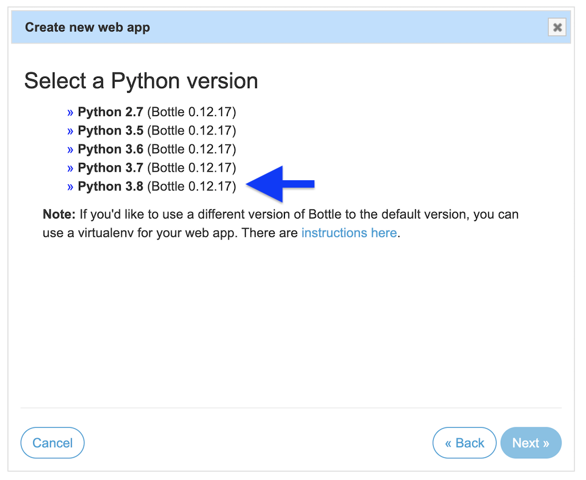
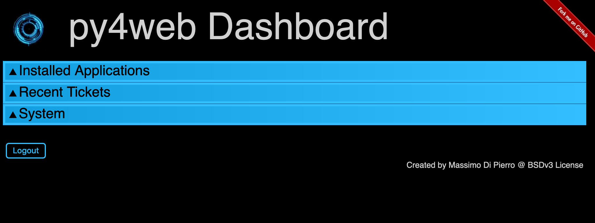

# How to install py4web from source on PythonAnywhere for free

One of the best ways to learn [py4web](https://py4web.com) is to create a
free account on [PythonAnywhere](https://pythonanywhere.com). While
PythonAnywhere has ready-to-go  presets for other frameworks, such as 
webp2y or Django, you'll have to install py4web yourself.

This tutorial shows you step by step how to install and run py4web.
It is meant for people with limited system administration knowledge, and it shouldn't leave anything out. 
Every keystroke should be documented. If you encounter any problems, or
need something explained better, please [file an issue](https://github.com/tomcam/py4webcasts/issues).

## Create a PythonAnywhere account

You need to create a free PythonAnywhere account. They don't require a credit card, which is impressive.

* [Create a PythonAnywhere account](create-pythonanywhere-account.md)

### Your username is your subdomain

The username you create will also serve as the subdomain name on a free account. For example,
if you username is totallycoolsite then its URL will be:

```
http://totallycoolsite.pythonanywhere.com
```

## Go to the PythonAnywhere dashboard

Let's make sure we're on the same page, which should the the dashboard.

* Choose the [PythonAnywhere logo](https://www.pythonanywhere.com/) at the top of the page to navigate to the PythonAnywhere dashboard.

You'll see a navigation menu near the top of the page that says **Dashboard  Consoles  Files  Web  Tasks  Databases**.

## Go to the WebApps page and create a new web app

* On the navigation bar near the top of the page that says **Dashboard  Consoles  Files  Web  Tasks  Databases** choose **Web**.

* Choose **Add a new web app**.

* A dialog appears called  **Create a new web app**

You're informed that PythonAnywhere is creating a URL for your site and displays that URL. The main part of the URL is your username followed by `pythonanywhere.com`.

* Choose **Next**.

### Choose the Bottle framework

The **Select a Python Web framework**  dialog appears, showing a list of frameworks like web2py, Django, Bottle, and so on.

Py4web uses [Bottle](http://bottlepy.org). So:

* Choose **Bottle** from the list.

You're asked to select a Python version.

* Choose **Python 3.8** (Bottle doesn't work with earlier versions):



The **Quickstart new Bottle Project** dialog appears. You're asked to give the location where a `bottle_app.py` file will be generated. 
It looks something like this, where `username` stands in for the username you created on signup.

```bash
Path:
/home/username/mysite/bottle_app.py
```

* Replace the `mysite` portion with `py4web`. 

* Replace the `username` with your account name. 

For example:

```bash
/home/username/py4web/bottle_app.py
```

* Choose **Next**.

You're shown a message saying `All done! Your web app is now set up. Details below.`

## Installing py4web from source on pythonanywhere

One of the distinct features of py4web is that it is nothing more than a Python program. py4web apps are nothing more than a simple
directory tree structure with a few files inside an applications subdirectory, called `apps` by default. 
This section shows how to clone the py4web repo
from GitHub. It uses the Bash command line console supplied with PythonAnywhere.

### Start the bash console

PythonAnywhere lets you run a bash console directly in your browser.
That means you don't have to install and configure ssh to remote in. Just run bash from 
their web page. It simulates a console right there. You can perform many common tasks as if it were happening on your
own desktop without having to fiddle with ssh configuration.

* From the **Dashboard  Consoles  Files  Web  Tasks  Databases** navigation menu choose **Consoles**.

You'll see **Start a new Console**.

* Next to Other, choose **Bash**.

After a few seconds, the Bash prompt appears in a new browser tab. It looks roughly like this: `~ $`.


## Clone the GitHub repo

The next step is to obtain a copy of the py4web distribution. The following copies the latest
supported major release into its own directory.

* Enter `git clone https://github.com/web2py/py4web.git` at the prompt:

```bash
$ git clone https://github.com/web2py/py4web.git
```

A list of progress messages scrolls down. It looks something like this, but longer:

```
Cloning into 'py4web'...
remote: Enumerating objects: 167, done.
remote: Counting objects: 100% (167/167), done.
...
Checking out files: 100% (660/660), done.
04:21 ~ $ 
```
The result is a `py4web` subdirectory in your root directory containing the py4web source treee.

### Change to the py4web directory and install using pip

Make py4web the current directory:

```bash
$ cd py4web
```

* Enter **python3 -m pip install --user -r requirements.txt** to install using pip:

```bash
# --user means install in your local directory 
#   Required on PythonAnywhere because you don't have 
#   permission to install globally.
$ python3 -m pip install --user -r requirements.txt
```

### Setup py4web itself

Now configure py4web:

```bash
$ ./py4web.py setup apps
$ ./py4web.py set_password
```

The `./py4web.py set_password` step asks you twice for a password. That will be used when you log into the py4web dashboard.

## Change your site's working directory

* Return to your PythonAnywhere tab.

* From the **Dashboard  Consoles  Files  Web  Tasks  Databases** navigation menu choose **Web**.

* Scroll down to the section headed **Code**, which shows **Source Code**, **Working Directory**, and other information.

### Make your py4web folder both the source code and working directory

* Click the URL next to **Source Code**. It is made editable. Make sure the end contains your URL followed by `/py4web`. Replace `username`
in the following example with your PythonAnywhere username:

/home/XXX/py4web

* Do the same for **Working directory**.

### Update your WSGI configuration file 

The WSGI configuration needs your project's home directory updated from its default value. Just under **Source code** and **Working directory** you'll see **WSGI configuration file**. 
You can open up a built-in editor for it simply by clicking.

* Click the link for **WSGI configuration file** and your WSGI configuration file appears in an editor.

You'll see something like this, with your username in place of `username`:

```
project_home = '/home/username/mysite'
```

* Change it to your py4web apps folder name like this, replacing `XXX` with your username, and replacing `mysite` with `py4web/apps` Make sure it all
stays within the quote marks:

```
project_home = '/home/username/py4web/apps'
```

* At the top of the page choose **Save** to preserve your changes.

### Update bottle_app.py

* Choose the browser tab running the PythonAnywhere bash shell.

Run your favorite editor on the file `~/py4web/bottle_app.py`:

```bash
# Replace vim with whatever editor you prefer
vim ~/py4web/bottle_app.py
```

* Replace the contents of `bottle_app.py` as follows. **Be sure to replace `apps` with `username/apps`, where `username` is your PythonAnywhere username.

```
import os
from py4web.core import wsgi
PASSWORD_FILENAME = 'password.txt'
DASHBOARD_MODE = 'full' or 'demo' or 'none'
APPS_FOLDER = 'username/apps'

password_file = os.path.abspath(os.path.join(os.path.dirname(__file__), PASSWORD_FILENAME))
application = wsgi(password_file=password_file,
                   dashboard_mode=DASHBOARD_MODE,
                   apps_folder=APPS_FOLDER)

```


### Reload your web app

* Return to the PythonAnywhere **Web** page

There is now a **Configuration** section with the name of your URL, and a big green **Reload** button with your URL on it.

* Choose the **Reload XXX.pythonanywhere.com** button, where XXX is used in place of your account name.

A wait icon appears for a few seconds, then the page returns to its previous state. You're finally ready to install py4web.

## Start py4web

* Choose the browser tab running the PythonAnywhere bash shell.

* Start py4web like so:

```bash
$ ./py4web.py run apps
```

This starts the built-in py4web web server and runs its own copy of the py4web site. It is now available
online at your PythonAnywhere URL.

## Visit your website

* Open a browser to the URL PythonAnywhere assigned you when you created the account. 

It's your username followed by `.pythonanywhere.com`, so if your username were `username` the URL to open in your browser would be `http://username.pythonanywhere.com/`.

It should look like this:


To begin writing py4web apps choose **Dashboard**.

* You'll be asked for the password you created earlier. When you enter it you'll see the py4web dashboard:



## Upgrading the framework code

At some point you may learn about a new py4web release.

# Upgrading py4web without affecting your apps 

At some point after you've installed py4web you'll want to update the framework code.
To update the framework without altering your `apps` folder, just use pip as described in
this linked article.

See [Upgrading py4web without affecting your apps](upgrading-py4web.md)

```bash
$ python3 -m pip install -U py4web
```
